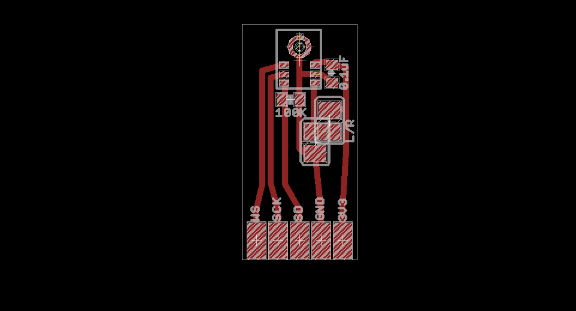
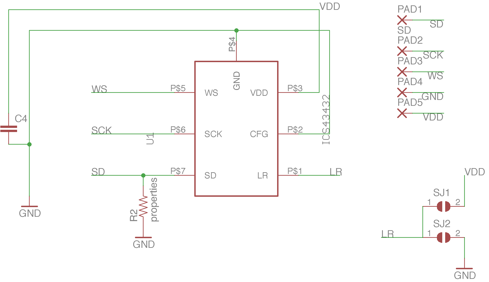

# ics43432-pi
ICS43432 mems mic for use with raspberry pi

Breakout board designed in EagleCAD. 

# ICS43432 Reference
http://www.invensense.com/wp-content/uploads/2015/02/ICS-43432_DS.pdf

# Kernel Module Installation

